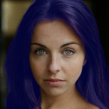
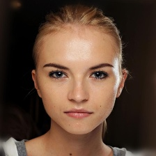
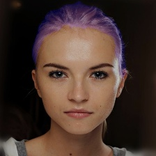

# Hair Segmentation Realtime using Keras

The architecture was inspired by [Real-time deep hair matting on mobile devices](https://arxiv.org/pdf/1712.07168.pdf)

[](https://travis-ci.org/thangtran480/hair-segmentation)

## Prerequisites
python 3.6 tensorflow-gpu==1.13.1, opencv-python==4.1.0.25, Keras==2.2.4, numpy==1.16.4, scikit-image==0.15.0

install environment in conda: 
```
conda env create -f environment.yml
```
## Dataset

* [CelebAMask-HQ](https://github.com/switchablenorms/CelebAMask-HQ) (contain 29.300 images and masks hair segmentation)
* [Figaro-1k](http://projects.i-ctm.eu/it/progetto/figaro-1k)
* [Lft](http://vis-www.cs.umass.edu/lfw/)

Download data **CelebAMask-HQ** and use preprocess in ./data/pre-process-data-CelebAMask-HQ.ipynb to create dataset

**Data structure training**
```
├── my-data
│   ├── train
│   │   ├──image
│   │   │   ├── 1.jpg
│   │   │   ├── 2.jpg
│   │   │   ├── 3.jpg
...
│   │   ├──mask
│   │   │   ├── 1.jpg
│   │   │   ├── 2.jpg
│   │   │   ├── 3.jpg
...
│   ├── val
...
│   ├── test
...
```


## Train model 

```shell script
python train.py [--datadir PATH_FOLDER] [--batch_size BATCH_SIZE] [epochs EPOCHS] [--lr LEARNING_RATE] []

optional arguments:
    --datadir:        path to folder dataset, default ./data
    --batch_size:     batch size training, default 4
    --epochs:         number of eposchs, default 5
    --lr:             learning rate, default 1e-4
    --image_size:     size image input, default (224, 224)
    --use_pretrained: use pretrained, default false
    --path_model:     directory is saved checkpoint, default ./checkpoints
    --device:         device training model, default 0 (GPU:0), 1(GPU:1), -1(CPU)          
```

## Evaluate model

```shell script
python evaluate.py
```

## Run pretrain model
```shell script
# Run test.py
python demo.py
```
You will see the predicted results of test image in test/data

## Result







## Convert to Tensorflow Lite
- Convert 
```shell script
# Convert Model to Mobile
python convert_to_tflite.py
```
- Show shape model tflite
```shell script
# Shape input and output shape model tflite 
python shape_input_output_tflite.py
```
## About Keras

Keras is a minimalist, highly modular neural networks library, written in Python and capable of running on top of either TensorFlow or Theano. It was developed with a focus on enabling fast experimentation. Being able to go from idea to result with the least possible delay is key to doing good research.

Use Keras if you need a deep learning library that:

allows for easy and fast prototyping (through total modularity, minimalism, and extensibility).
supports both convolutional networks and recurrent networks, as well as combinations of the two.
supports arbitrary connectivity schemes (including multi-input and multi-output training).
runs seamlessly on CPU and GPU.
Read the documentation [Keras.io](http://keras.io/)

Keras is compatible with: Python 3.6.

## TODO
- [x] Implement model using Keras 
- [x] Convert model to Tensorflow Lite
- [ ] Implement model to Android (``DOING``)

## License
Copyright (c) 2019 Thang Tran Van

Licensed under the MIT License. You may not use this file except in compliance with the License


