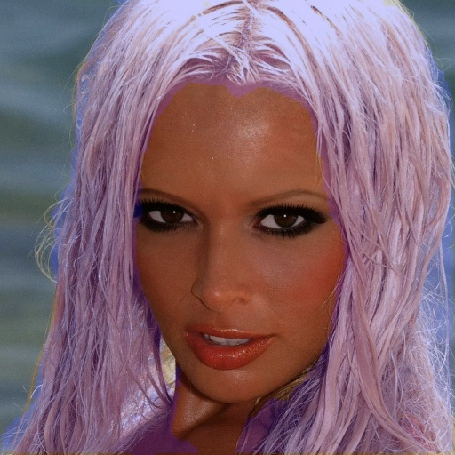

# Hair Segmentation using Keras

The architecture was inspired by [Real-time deep hair matting on mobile devices](https://arxiv.org/pdf/1712.07168.pdf)

---

## Prerequisites
python 3.6
```
tensorflow-gpu==1.13.1
opencv-python==4.1.0.25
Keras==2.2.4
numpy==1.16.4
scikit-image==0.15.0
```
## Dataset

* [Figaro-1k](http://projects.i-ctm.eu/it/progetto/figaro-1k)
* [Lft](http://vis-www.cs.umass.edu/lfw/)

I've downloaded it and done the pre-processing. You find it in folder data/image (images original) and data/label(images mask)

## Train model 

```
# You can config train model in train.py
python train.py
```

## Predict model
```
# Run test.py
python test.py
```
You will see the predicted results of test image in test/data

## Result



## About Keras

Keras is a minimalist, highly modular neural networks library, written in Python and capable of running on top of either TensorFlow or Theano. It was developed with a focus on enabling fast experimentation. Being able to go from idea to result with the least possible delay is key to doing good research.

Use Keras if you need a deep learning library that:

allows for easy and fast prototyping (through total modularity, minimalism, and extensibility).
supports both convolutional networks and recurrent networks, as well as combinations of the two.
supports arbitrary connectivity schemes (including multi-input and multi-output training).
runs seamlessly on CPU and GPU.
Read the documentation [Keras.io](http://keras.io/)

Keras is compatible with: Python 3.6.
